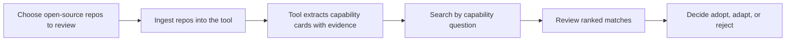
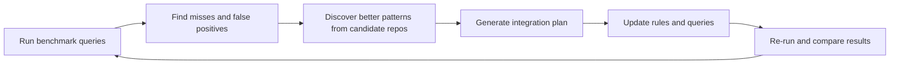

# Project Workflow (Simple View)

This is the plain-language flow for how the project works.

## Continuous Improvement Loop

## What This Means in Practice

- You point the tool at local repositories.
- The tool builds searchable capability summaries with file evidence.
- You search in natural language (for example: "document processing pipeline").
- You get ranked candidates to evaluate quickly.
- The team then decides whether to adopt, adapt, or reject each capability.
- Regular benchmark/discovery cycles improve accuracy over time.
