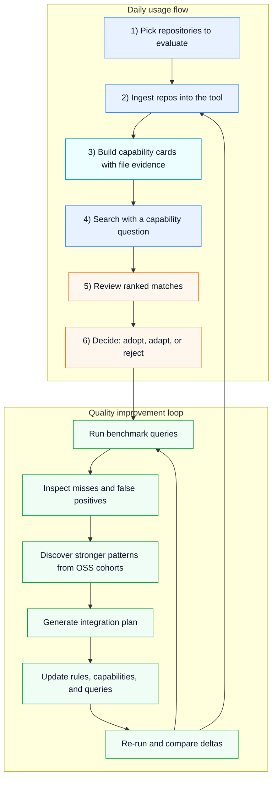

# Capability Search Experiment v1

This project is a capability search engine for open-source repositories.
It scans local repos, detects what they can do (for example OCR processing,
API service, and CLI tooling), and converts those signals into structured
capability cards backed by file-path evidence.

Those capability cards act as an intermediate representation (IR) layer used
for hybrid retrieval that combines lexical search, semantic embeddings, and
confidence/validation scoring.

This experiment now includes a deeper v2-style pass:

- Evidence-backed capability extraction.
- Structural validators per capability (to reduce false positives).
- True embedding-based semantic retrieval using `fastembed`.
- Hybrid ranking that combines lexical, semantic, confidence, and validation score.

## What this does

- Ingest local repositories.
- Build capability cards with metadata and file-path evidence.
- Validate cards with structural rules (route signatures, OCR indicators, CLI signatures, etc).
- Store card embeddings in SQLite.
- Query with one of 3 modes:
  - `lexical` (FTS-focused)
  - `semantic` (embedding-focused)
  - `hybrid` (combined ranker)

## Visual pipeline



- Standalone version: `PIPELINE_DIAGRAM.md`

## Files

- `capability_index.py` - main CLI for init/ingest/search/list.
- `iterative_repos_test.py` - baseline iterative run.
- `iterative_modes_test.py` - iterative lexical vs semantic vs hybrid comparison.
- `V2_NOTES.md` - noise-reduction findings and trade-offs.
- `phase2/` - process-lab assets for benchmark, mining, and challenge loops.
- `phase3/` - candidate capability discovery workflow and reports.
- `phase4/` - integration-planning artifact generation from discovery output.
- `data/*.db` - local SQLite DB files.
- `data/*report*.json` - run reports.

## Setup

```bash
python3 -m venv .venv
.venv/bin/python -m pip install -r requirements.txt
```

## Quick start

```bash
.venv/bin/python capability_index.py --db ./data/capabilities.db init
.venv/bin/python capability_index.py --db ./data/capabilities.db ingest --repo-path ./repos/OCRmyPDF
.venv/bin/python capability_index.py --db ./data/capabilities.db ingest --repo-path ./repos/flask
.venv/bin/python capability_index.py --db ./data/capabilities.db search --query "python api service" --k 5 --mode lexical
.venv/bin/python capability_index.py --db ./data/capabilities.db search --query "python api service" --k 5 --mode semantic
.venv/bin/python capability_index.py --db ./data/capabilities.db search --query "python api service" --k 5 --mode hybrid
.venv/bin/python capability_index.py --db ./data/capabilities.db search -q "fast code search" --top 8
.venv/bin/python capability_index.py --db ./data/capabilities.db search -q "semantic retrieval" --response verbose
.venv/bin/python capability_index.py help search
```

## Agent-first CLI behavior

- Defaults to `--response final`, which prints only final ranked results.
- Use `--response verbose` (or `--verbose`) to include search/ingest steps and diagnostics.
- Includes command aliases to reduce friction: `--repo` for `--repo-path`, `-q` for `--query`, and `--top` for `--k`.

## How to call it

Use placeholders so the same command shape works across environments.

```bash
# Core capability index
.venv/bin/python capability_index.py init --db <db-path>
.venv/bin/python capability_index.py ingest --repo <local-repo-path> --db <db-path>
.venv/bin/python capability_index.py search -q "<capability-query>" --top <k> --db <db-path>

# Verbose diagnostics
.venv/bin/python capability_index.py search -q "<capability-query>" --db <db-path> --response verbose

# Help and command discovery
.venv/bin/python capability_index.py help
.venv/bin/python capability_index.py help search

# Cohort-driven discovery and planning pipeline
.venv/bin/python phase3/scripts/build_phase3_cohort.py \
  --targeting-spec <targeting-spec-json> \
  --repo-registry <repo-registry-json> \
  --output <cohort-manifest-json>

.venv/bin/python phase3/scripts/run_phase3_discovery.py \
  --cohort-manifest <cohort-manifest-json> \
  --capabilities-file <candidate-capabilities-json> \
  --report <discovery-report-json>

.venv/bin/python phase4/scripts/run_phase4_plan.py \
  --discovery-report <discovery-report-json> \
  --stability-report <discovery-report-rerun-json> \
  --cohort-manifest <cohort-manifest-json> \
  --output-dir <phase4-output-dir>
```

## Iterative tests

```bash
.venv/bin/python iterative_repos_test.py
.venv/bin/python iterative_modes_test.py
```

## Notes

- This is still an experiment, not production-grade static analysis.
- Structural validation helps, but noisy cards can still appear.
- Embeddings improve semantic matching, but extraction quality still dominates final precision.
